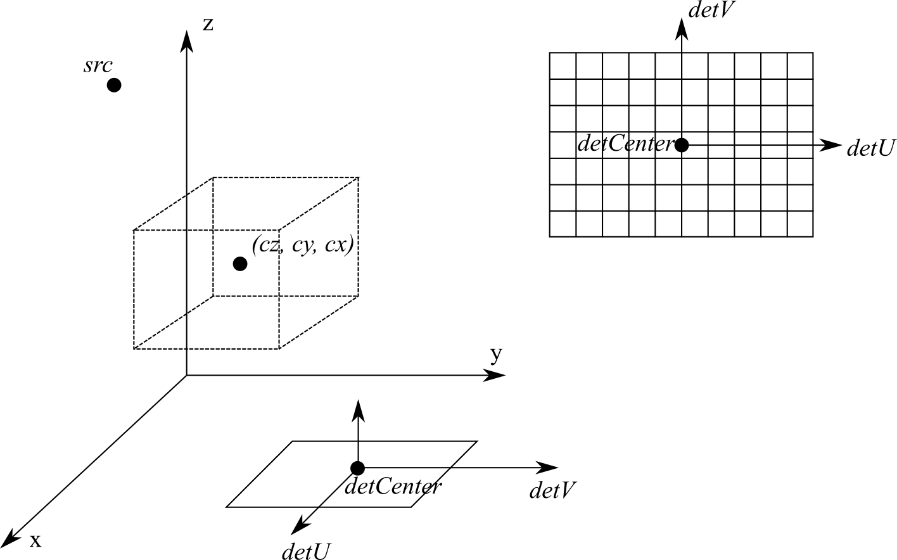

# Examples how to use ct_projector

## Data
`3.nii.gz` is a 3D CT volume, you should replace it with any available CT volume. (`TODO: replace 3.nii.gz with a numerical phantom that can be dynamically generated.`)

`CTA0296_7_2.npy` is also a 3D CT volume. You can replace it with any available CT volume.

## Geometry
### Arbitrary geometry
The arbitrary geometry applies to projector/backprojector that receives parameters such as `srcs`, `detCenters`, `detU`, `detV`. The geometry is given in the following figure:




#### Image
The image volume is fixed, where the center of the image is given by `(cz, cy, cx)`, the voxel size given by `(dz, dy, dx)` in mm, and the image size given by `(nz, ny, nx)`. The image grid is always along the world coordinates xyz. To convert from the image coordinate `(iz, iy, ix)` to the physical coordinate `(z, y, x)`, one should use the following equation (take `x` for example):

```
x = (ix - (nx - 1) / 2) * dx + cx
```

Here `(z, y, x)` will be the physical coordinates of the center of voxel `(iz, iy, ix)`.

#### Source
In each view, the source location is given by its physical coordinate in the world system, `(sz, sy, sx)`. See the projector/backprojector functions' help for how to pass the coordinates to the functions.

#### Detector
In each view, the detector's location is given by its center location `detCenter`, and the directions `detU` and `detV`. All three are length-of-3 vectors which gives the x, y, and z components. `detCenter` determines where the detector is, and `detU` and `detV` determine the detector plane and orientation. 

As shown in the figure, for a point `(iv, iu)` on the detector, its physical coordinate in the world system will be calculated as

```
v = (iv - off_v - (nv - 1) / 2) * dv
u = (iu - off_u - (nu - 1) / 2) * du

z = detCenter.z + u * detU.z + v * detV.z
y = detCenter.y + u * detU.y + v * detV.y
x = detCenter.x + u * detU.x + v * detV.x
```

Where `(nv, nu)` is the detector size in pixels. `(dv, du)` is the pixel size in mm. `(off_v, off_u)` the offset between `detCenter` on the detector and the detector image center `((nv - 1) / 2, (nu - 1) / 2)`. Usually they can be zero by setting `detCenter` to be overlapped with the image center in every view.

## Examples
### ex_fp_bp
Example on arbitrary cone beam projection and backprojection with flat panel detector and Siddon algorithm. Corresponding to `siddon_fp(bp)_arbitrary`.

### ex_recon_tv
Example on TV penalized reconstruction. 

### ex_recon_gaussian
Example on L2 penalized reconstruction. It has a closer appearance to FBP and is preferred for normal-dose, fully-sampled reconstruction. Note that the reconstruction wrappers from `ct_projector.recon` are just python wrappers and can be easily changed to any reconstruction algorithms that only requires forward and backprojections.